<!-- Troca SEU-USERNAME pelo teu username do GitHub e o link do LinkedIn pelo teu -->

 

---

## 🐧 Sobre Mim

Sou estudante do curso de **Programador de Informática**, com interesse em **desenvolvimento de software**, **inteligência artificial** e na área da **astronomia**. 🌌

- 🔭 A trabalhar em projetos de software e a explorar IA
- 🌱 A aprender e a melhorar todos os dias
- 💬 Pergunta-me sobre programação, IA ou o universo
- ⚡ Curiosidade: gosto de olhar para as estrelas tanto quanto de olhar para o código

---

## 💻 Linguagens

  

## 🌐 Desenvolvimento Web

  

## 🗄️ Base de Dados

  

## 🛠️ Ferramentas

  

---

## 📊 Estatísticas do GitHub

 

---

## 📫 Contactos

  
  

